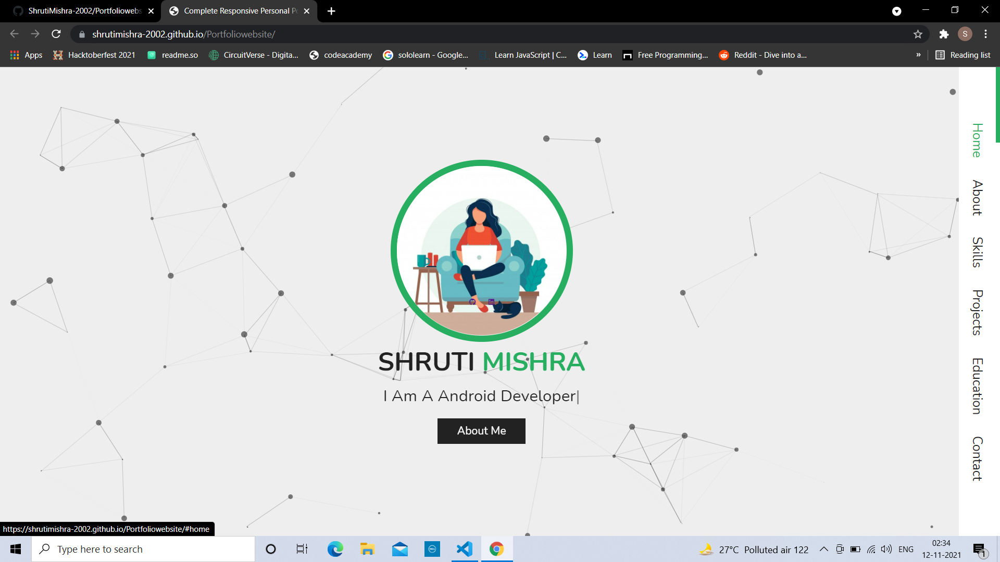

## Portfolio-Website

<h2> Website Link : 
<a href="https://shrutimishra-2002.github.io/Portfoliowebsite/" target="_blank">HAVE A LOOK</a>
</h2> 

## 📌 Tech Stack:
[]
[]
[]
[]

#### Extras : Particle.js, Typed.js, Tilt.js, Font Awesome etc.

## 📌 Main Page:

<h2> Contact :</h2>

<a href="mailto:shrutidmishra2002@gmail.com">

© 2021 Shruti Mishra 
